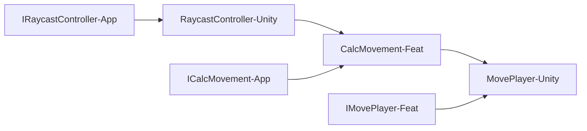

# Refactoring

Lucky me, I need to test my code for the game. That means putting everything into `asmdef`s so I can work with parts individually. This also means I am going to have to refactor A TON OF STUFF. My code is currently very noodley. Everything is connected for better or for worse. As soon as I put the `PlayerController` folder into an `asmdef` I instantly got 300+ errors. The goal now: organize `PlayerController` so that it works and is testable with DI.

## The Onion
From what I've read, to use DI properly I need to structure my `asmdef`s so that they depend on each other in a meaningful way. To do this I've created different layers:
1. Core
2. Application
3. Features
4. Unity

The rules for assigning things to different layers is based on what the thing does, what it interacts with, and what ultimately uses it. For example: nothing in the Core, Application, OR Features layers can depend on Unity. (except for Unity's math). Interfaces defined in Core are implemented in Application. Interfaces defined in Application are implemented in Features and so on. This has resulted in some interesting architecture.

As an example I'm going to use the `PhysicsHandler.cs` class. The original `PhysicsHandler` was a subclass of `RaycastController`. It added 1 new method, `Move`, and used all of the methods within `RaycastController` to perform the calculations and actually move the player.

This relationship has been changed to:

This is all pretty confusing without proper layers...
