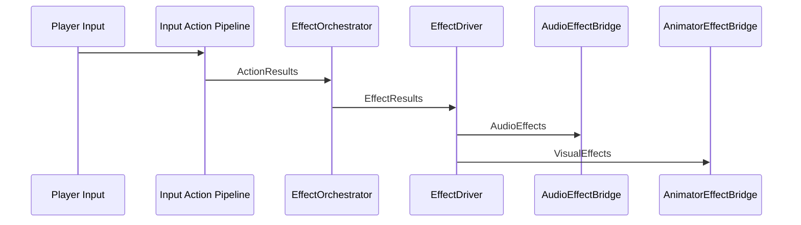

# Effect Pipeline

## Overview
The effect pipeline is a data pipeline that uses the current physics context, player rule state, and action results to produce different visual and audio effects. The effect pipeline piggybacks off of the input-action pipeline by reading the action results returned by the pipeline, the physics context used to evaluate the requests, and the updated player rule state. This makes the effect pipeline a reactive system dependent on the results of the input-action pipeline.

## How It Works
The effect pipeline is a pipeline used to animate the player, request audio, emit particles, and control/request anything else having to do with visual and audio effects for the player. The system takes advantage of the [[Input Action Pipeline.md]] by gathering up the results at the end of the pipeline and using them to determine what effect to play.

The main pieces of data that the effect pipeline needs are:
1. **Action Results**: The results created by the input action pipeline.
2. **Physics Context**: This is the same physics context used to generate the above results.
3. **Player Rule State**: The resulting rule state after the input action pipeline has run.

Currently the effect orchestrator uses the above pieces of information to achieve the same goal: generate `IEffectResult` objects. 
Effect results are created in one of two ways:
1. Converting action results
2. Reading the player rule state
   
The action results are converted into effect results where possible using a switch case:
```c#
// Action result: RunResult
case RunResult run:
    {
        // RunResult is converted into a StepEffect, an audio effect for playing foot sounds
        StepEffect effect = _stepDetector.TryStep(_physicsContext, 5f);
        _effectResults.Add(effect);
        break;
    }
```
The player rule state is read to create effects that aren't the direct result of an action request:
```c#
    if (_ruleState.IsInvincible || _ruleState.IsStunned)
    {
        _effectResults.Add(new IFrameEffect(true));
    }
    else
    {
        _effectResults.Add(new IFrameEffect(false));
    }
```
Note that the physics context is only used with audio effects to determine what type of surface the player is on. This allows the audio effect bridge to play different step, jump, and landing sounds based on the surface type.

The EffectResults created by the orchestrator are then sent to the EffectDriver to be handled by the audio and visual systems. The following diagram illustrates how an effect goes from an `IActionRequest` generated by player input to an `IActionResult` to an `IEffectResult`.

### Bark Example


## Perks
The Effect Pipeline has proven very robust and scalable. It follows the same command-request-result pattern that I implemented in the [[Input Action Pipeline]]. This makes the system very scalable. If I want to add a new effect, all I need to do is create a new implementation of `IEffectResult` and add it to the player effect orchestrator to be generated. 

## Future Work
Currently I am not happy with the implementation of the Effect Pipeline. The problem is that it relies on multiple data sources in order to function. Ideally the system would either only use the `PlayerRuleState` OR the `IActionResult` list to generate effects if possible. Furthermore the physics context is only used to determine the surface type particular actions take place on. The `IActionResult`s for jumping, landing, and running could be refactored to hold the surface type. That way the effect orchestrator wouldn't need to query the physics context.

[Input Action Pipeline.md]: <../Input Action Pipeline/Input Action Pipeline.md> "Input Action Pipeline"

[Input Action Pipeline]: <../Input Action Pipeline/Input Action Pipeline.md> "Input Action Pipeline"
