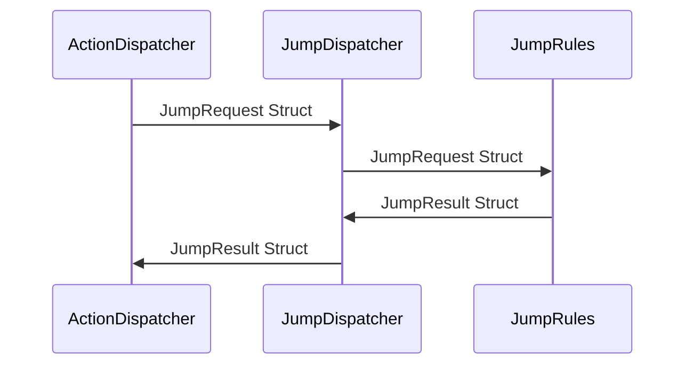

# Input Action Pipeline

[TOC]

## Overview
For the game I have developed an Input Action Pipeline to handle player inputs while in game. I did this to make it easier to iterate on ideas, develop a clear separation of concerns, and keep my architecture testable and scalable. The input action pipeline is a system that takes in user inputs, evaluates them, and then acts on them via the physics manager. This system is the backbone of all movement and inputs within the game.

## How it works
The input action pipeline uses the command pattern to read player inputs and convert them into `struct`s that implement the `IActionRequest` interface. This interface contains one property `RequestType` of type `Type`. This keeps the struct simple and has allowed me to define many different types of requests. Requests for a given frame are stored in the `PlayerActionContext` within the `PlayerActionOrchestrator`. 
```c#
    public interface IActionRequest
    {
        Type RequestType { get; }
    };
```

The `PlayerActionOrchestrator` is responsible for gathering input and physics data, as well as updating effects (like audio and visual effects) and forwarding `IActionResults` to the entity's `PhysicsActor`. The `PlayerActionOrchestrator` is the main hub of information and updates for the player.

The `PlayerActionContext` is another `struct` that holds data related to the player for that given frame. The `PlayerActionContext` is created within `PlayerActionOrchestrator`'s `Update()` loop and contains the following information:
- CurrentRequests: A list of the `IActionRequests` generated that frame.
- Facts: The current physical context of the player.
- RuleState: The `PlayerRuleState` the core of the action pipeline where the rules for the player's state are contained.
- CurrentGameState: An enum representing the current game state ie InGame, Paused, etc.
- InputValues: A struct containing the input state of the controller. It contains the current values of the different buttons and control sticks.
- Dt: The frame delta time used to synchronize different time based rules.
```c#
    [System.Serializable]
    public class PlayerActionContext
    {
        public List<IActionRequest> CurrentRequests;
        public PhysicsContext Facts;
        public PlayerRuleState RuleState;
        public GameState CurrentGameState;
        public InputState InputValues;
        public float Dt;
    }
```


As you can see, the `PlayerActionContext` is a summary of everything that is going on inside of the player for a given frame and it contains all necessary information to make decisions about the player's actions and abilities for that frame.

After the `PlayerActionContext` has been created it is sent to the `AppOrchestrator` which is the application level orchestrator for the player. The `AppOrchestrator` performs three important tasks:
1. It updates the `PlayerRuleState` for that frame.
2. It dispatches `IActionRequest`s to be evaluated.
3. It evaluates any environmental actions that need to be checked every frame. Environmental actions are things like falling, running into a wall, or landing from a fall.

Updating the player's rule state is handled entirely within the `PlayerRuleState` class. Evaluating the requests for that frame is handled by the `ActionDispatcher`. The `ActionDispatcher` sends action requests to be evaluated against the rules for that request and returns the `IActionResult`, the result of that evaluation. Every action has a unique request, dispatcher, rule set, and result associated with it. For example the flow for a jump request would look like:


After the `ActionDispatcher` has evaluated all of the requests it returns a list of `IActionResult`s. The `IActionResult` interface has three fields used to describe the result of a request:
1. ResultType, `Type`, for discerning between results.
2. Approved, `bool`, the actual result of the evaluation.
3. Phase, `ActionPhase`, an enum the decides where this result belongs in the list of results.

All results are sorted by `ActionPhase` before being sent back up the chain. There are three different action phases:
1. Override - evaluated first, for actions that can ignore kinematics like teleporting.
2. Impulse - evaluated second, for actions that happen once per frame like a jump.
3. Continuous - evaluated last, for actions that happen every frame like running.
```c#
    public interface IActionResult
    {
        public Type ResultType { get; }
        public bool Approved { get; }
        public ActionPhase Phase { get; }
    };
```


Once the result list has been generated it is returned to the `PlayerActionOrchestrator` and sent to the `PhysicsActor` and be applied by the `PhysicsManager` by the end of the current frame.

The following diagram shows the full

```mermaid
sequenceDiagram
participant PhysicsActor
participant InputProvider

    InputProvider->>PlayerActionOrchestrator: Player submits an input
    PlayerActionOrchestrator->>AppOrchestrator: PlayerActionContext
    AppOrchestrator->>ActionDispatcher: Action request list
    ActionDispatcher->>ActionRule: Action request
    ActionRule->>ActionDispatcher: Action result
    ActionDispatcher->>AppOrchestrator: Action results list
    AppOrchestrator->>PlayerActionOrchestrator: Action results list
    PlayerActionOrchestrator->>PhysicsActor: Action results list
