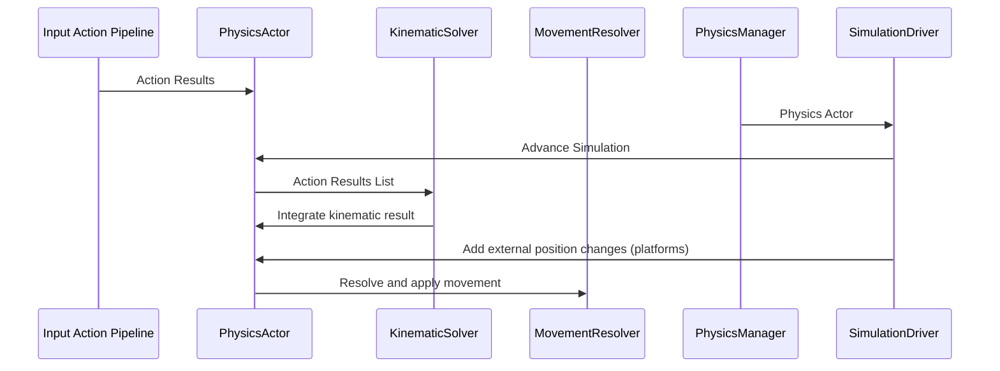

# Physics System

## Overview
The game currently uses custom physics allowing me to fine tune player interactions in the game. The physics system is comprised of physics actors and a central physics manager. A physics actor is any entity that needs to be simulated. The physics manager is a singleton class used that orchestrates the physics actors and the simulation driver in order to perform physics calculations.

## Physics Actor
The `PhysicsActor` monobehaviour is a class implementing the `IPhysicsActor` interface.
```c#
public interface IPhysicsActor
    {
        public ActorType Actor { get; }
        public string Name { get; }
        public PhysicsContext CurrentContext { get; }
        public Vector2 MoveVector { get; set; }
        public ISolveKinematics KinematicSolver { get; }
        public IMovementResolver MovementResolver { get; }
        public KinematicResult KinematicState { get; }
        public List<IActionResult> ActionResults { get; }
        public IBoundsProvider Bounds { get; }

        public void UpdateContext();
        public void EnqueueActionResults(List<IActionResult> actionResults);
        public void EnqueueActionResults(IActionResult actionResult);
        public void SolveKinematics(float dt);
        public Vector2 IntegrateVelocity();
        public void Move();

        public void RegisterCapability(object capability);
        public T GetCapability<T>() where T : class;
    }
```
The `PhysicsActor` class is a Unity level class that interfaces with the `PhysicsManager` class to provide action results from the [[Input Action Pipeline]], calculate the kinematics, and apply movement. The physics actor is entity level hub for all physics information. It provides information for the current frame for that entity. The physics actor is assigned via the inspector as a component and is reused across all objects that interact with the physics system including players, enemies, projectiles, and platforms.

The `PhysicsActor` class contains all of the necessary methods for calculating and resolving its kinematic state. This was done to reduce the responsibilities of the `PhysicsManager`. The `PhysicsManager` is only responsible for driving the simulation via `ISimulationDriver`, sorting actors into the correct order for evaluation, and resolving trigger interactions.

## Physics Manager
The `PhysicsManager` is a singleton class that exists on the Physics Manager game object as a child of the Game Systems game object. The `PhysicsManager` is the orchestrator for all `PhysicsActor`s and triggers in a given scene.
```c#
    public interface IPhysicsManager
    {
        public List<IPhysicsActor> ActorRegistry { get; }
        public void Register(IPhysicsActor actor);

        public List<ITriggerVolume> TriggerRegistry { get; }
        public void Register(ITriggerVolume trigger);
    }
```
Overall, the physics manager class is very light weight. It holds references to triggers and actors and updates them in `FixedUpdate()`.

 The `PhysicsManager` plays a very important role within the game. It is the sole orchestrator for all physics interactions that take place in the game. This is very important for two reasons.
1. I can control the order that physics actors are updated in. (Very important for moving platforms)
2. I have a deterministic physics engine. This is only entity allowed to use `FixedUpdate()`

Having all physical interactions routed through a single class is great. It offers a lot more flexibility and control and avoids A LOT of the Unity pain points. Most notably race conditions between fixed updates and non-deterministic physics. Having both under control in one class will be essential in any future game dev projects I take on.

## Simulation Driver
The `SimulationDriver` is a monobehaviour class used for advancing the game's simulation.
```c#
    public interface ISimulationDriver
    {
        public void Solve(IPhysicsActor actors);
        public void AdvanceSimulation(float dt, IPhysicsActor actor);
    }
```
This class has one purpose: solve each actor's kinematic state for the current frame. This class is also super boring. So boring in fact I can include it in it's entirety here.
```c#
    public class SimulationDriver : MonoBehaviour, ISimulationDriver
    {
        public void Solve(IPhysicsActor actor)
        {
            // Get dt
            float dt = Time.fixedDeltaTime;
            AdvanceSimulation(dt, actor);
        }

        public void AdvanceSimulation(float dt, IPhysicsActor actor)
        {
            // Solve for the actor's kinematic solution based off their action results
            actor.SolveKinematics(dt);

            // Calculate frame displacement based off the actor's kinematic result
            Vector2 displacement = actor.IntegrateVelocity();

            // If we're on a moving platform, add the platform's displacement
            if (actor.CurrentContext.IsOnPlatform)
            {
                displacement += actor.CurrentContext.PlatformDelta;
            }
            // Send that result to the movement resolver
            actor.MoveVector = actor.MovementResolver.ResolveMovement(displacement);
        }
    }
```
Essentially, the simulation driver is a glorified calculator. It takes a physics actor and tells the actor to solve it's kinematics, resolve it's displacement, and then to move. Honestly I could probably move this to the application layer and have the physics manager instantiate it.

## Kinematic Controller
Each physics actor in the game implements my custom Kinematic Controller. This controller is based heavily off of Sebastian Lague's 2D Platformer Controller series on YouTube.

The kinematic controller implements a raycast system to determine movement every frame. Given a velocity vector, the controller performs a raycast in the given direction to determine if the player will collide with anything. The length of each raycast is the distance the player would travel for the duration of one frame:  

$
s = V*dt
$

Where:
- s is the distance traveled in units.
- V is the current velocity in units/second.
- dt is the frame delta in seconds.

This basic idea lays the ground work for the rest of the physics system. 

The kinematic controller works in tandem with the [[Input Action Pipeline]], `PhysicsActor`, `PhysicsManager`, and the `SimulationDriver` by resolving the resulting velocity for each physics step and applying it to the player. The kinematic controller is made up of a collection of scripts within the game: the `RaycastController`, `MovementResolver`, and `MovementController`. The `RaycastController` is a helper class used to calculate raycast lengths and return hits. The movement resolver evaluates the results of the raycast hits and determines how far the player can move that frame. Finally, the MovementController applies the result of the movement resolver to actually move the player.

The following illustrates the sequence of events for one physics step in the game.


[Input Action Pipeline]: <../Input Action Pipeline/Input Action Pipeline.md> "Input Action Pipeline"
