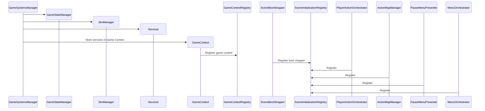
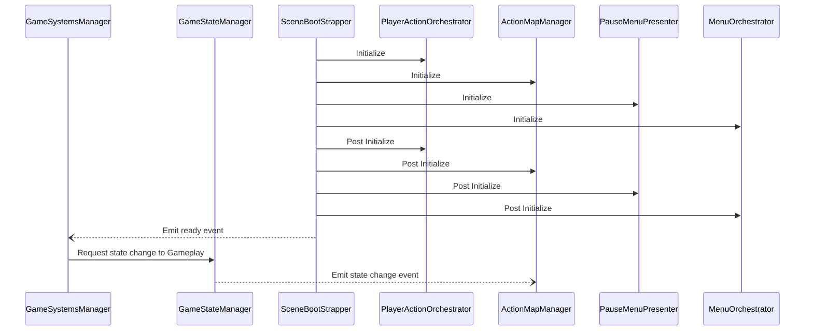

# Scene Start up
The following diagrams depict the start up order for the given scene from a very high level. It glosses over most of the objects that are contained within other classes like the `AppOrchestrator`. The point is to show how Unity's builtin lifecycle is managed.  
The key takeaways are:
- Instantiation is shared between the game systems manager and the scene boot strapper.
- The game systems manager builds the game context in order to distribute services.
- Services are distributed via the boot strapper.
- Systems that require the game context register with the boot strapper in Awake
- In Start, the boot strapper initializes registered systems in two passes, initialize and post initialize in order to prevent race conditions.
- The game state is held in "Booting" until the boot strapper finishes initialization at which point the game systems manager requests a change to the gameplay state.

# Scene Awake Sequence

# Scene Start Sequence
